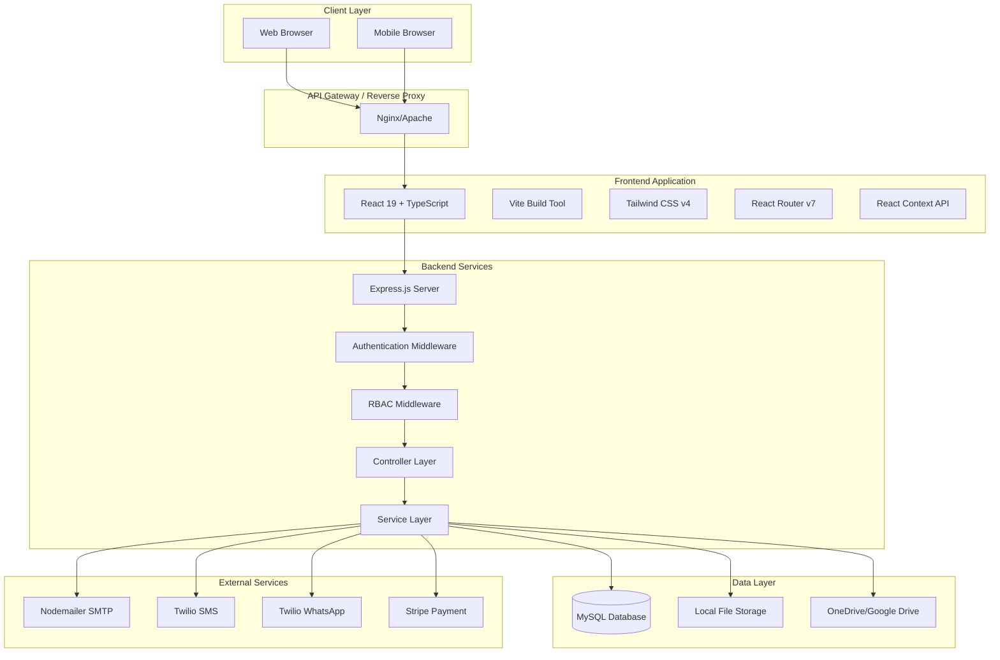

# Comprehensive System Architecture Review
## Smart Health Management System (SHMS)

**Review Date:** January 2025  
**Version:** 1.2.0  
**Review Scope:** Full system architecture analysis across Scalability, Security, Maintainability, and Performance dimensions

---

## Executive Summary

This comprehensive architecture review evaluates the Smart Health Management System (SHMS), a healthcare management platform built with React 19, Node.js/Express, and MySQL. The review identifies architectural strengths, weaknesses, and provides actionable improvement recommendations across four critical dimensions: Scalability, Security, Maintainability, and Performance.

### Key Findings

**Strengths:**
- Modern technology stack with TypeScript throughout
- Comprehensive RBAC implementation with granular permissions
- Strong security foundation with JWT authentication, CSRF protection, and rate limiting
- Well-structured modular architecture
- Good test coverage foundation

**Critical Issues:**
1. **Database Connection Pooling:** Limited to 10 connections, potential bottleneck under load
2. **No Caching Layer:** Missing Redis or in-memory caching for frequently accessed data
3. **Monolithic Backend:** Single Express server limits horizontal scaling
4. **Direct Database Queries:** No ORM layer, increasing maintenance complexity
5. **Frontend State Management:** Basic Context API may not scale for complex state

**Top Recommendations:**
1. Implement Redis caching layer (Priority: High)
2. Increase database connection pool size and implement connection monitoring (Priority: High)
3. Introduce API response caching middleware (Priority: Medium)
4. Consider microservices architecture for high-traffic modules (Priority: Low)
5. Implement database query optimization and indexing review (Priority: High)

---

## 1. Current Architecture Overview

### 1.1 System Architecture Diagram



### 1.2 Technology Stack

#### Frontend
- **Framework:** React 19.0.0 with TypeScript
- **Build Tool:** Vite 6.0.5
- **Styling:** Tailwind CSS v4.1.17
- **UI Components:** shadcn/ui (Radix UI primitives)
- **Routing:** React Router v7.1.1
- **State Management:** React Context API
- **Charts:** Recharts 2.15.4
- **Forms:** React Hook Form 7.66.0 with Zod validation
- **HTTP Client:** Native Fetch API

#### Backend
- **Runtime:** Node.js 18+
- **Framework:** Express.js 4.18.2
- **Language:** TypeScript 5.3.3
- **Database:** MySQL 8.0+ (mysql2 3.6.5)
- **Authentication:** JWT (jsonwebtoken 9.0.2, jose 5.2.0)
- **Security:** Helmet 7.1.0, express-rate-limit 7.1.5, CSRF protection
- **File Upload:** Multer 2.0.2
- **Email:** Nodemailer 7.0.10
- **SMS/WhatsApp:** Twilio 5.10.5
- **Payments:** Stripe 14.25.0
- **Scheduling:** node-cron 4.2.1

#### Infrastructure
- **Process Manager:** Not specified (PM2 recommended)
- **Reverse Proxy:** Nginx/Apache
- **SSL/TLS:** Self-signed certificates (development), Let's Encrypt (production)
- **Containerization:** Docker (optional, mentioned in docs)

### 1.3 Component Architecture

#### Frontend Structure
```
src/
├── components/          # Reusable UI components
│   ├── layout/         # Layout components (Sidebar, Header)
│   ├── ui/             # shadcn/ui components
│   └── security/       # Security-related components
├── contexts/           # React Context providers
│   ├── AuthContext.tsx
│   └── AuditContext.tsx
├── pages/              # Page components (route handlers)
├── services/           # API service layer
│   └── api.ts          # Centralized API client
├── hooks/              # Custom React hooks
├── utils/              # Utility functions
└── lib/                # Library configurations
```

#### Backend Structure
```
server/src/
├── config/             # Configuration files
│   ├── database.ts     # MySQL connection pool
│   └── jwt.ts          # JWT manager
├── controllers/        # Request handlers (18 controllers)
├── services/           # Business logic layer
├── middleware/         # Express middleware
│   ├── auth.ts         # Authentication & authorization
│   ├── csrf.ts         # CSRF protection
│   └── errorHandler.ts # Error handling
├── routes/             # Route definitions (17 route files)
├── database/           # Database scripts
│   ├── schema.sql      # Database schema
│   └── seed.sql        # Seed data
├── jobs/               # Scheduled jobs
│   ├── backup.job.ts
│   └── inventory.job.ts
└── tests/              # Test files
```

### 1.4 Data Flow

1. **Authentication Flow:**
   - User submits credentials → Frontend API service → Backend `/api/auth/login`
   - Backend validates credentials, checks account lockout status
   - JWT token generated with user info and permissions
   - Token stored in localStorage (frontend) and sent in Authorization header
   - Token validated on each protected route via `authenticate` middleware

2. **Authorization Flow:**
   - Request arrives with JWT token
   - `authenticate` middleware validates token and extracts user info
   - `requirePermission` middleware checks role-based permissions
   - Permission check queries database for role permissions (supports hierarchical roles)
   - Hospital-scoped modules verify user's hospital context

3. **Data Request Flow:**
   - Frontend component calls API service method
   - API service checks in-memory cache and localStorage
   - If not cached, sends HTTP request to backend
   - Backend controller validates request, checks permissions
   - Service layer executes business logic and database queries
   - Response returned to frontend, cached if applicable

### 1.5 Database Schema Overview

**Core Tables:**
- `users` - User accounts with authentication info
- `roles` - Role definitions
- `permissions` - Role-module-action permissions matrix
- `hospitals` - Hospital entities
- `departments` - Hospital departments
- `staff` - Staff members
- `patients` - Patient records
- `appointments` - Appointment scheduling
- `documents` - Document metadata
- `medicines_inventory` - Pharmacy inventory
- `accounts` - Financial chart of accounts
- `transactions` - Financial transactions
- `audit_logs` - System audit trail

**Key Relationships:**
- Users → Roles (many-to-one)
- Roles → Permissions (one-to-many)
- Patients → Hospitals (many-to-one)
- Staff → Departments → Hospitals (hierarchical)
- Appointments → Patients, Staff, Hospitals

### 1.6 Deployment Architecture

**Current Setup:**
- Frontend: Static files served via Nginx/Apache
- Backend: Node.js process (PM2 recommended but not configured)
- Database: MySQL on same server or separate instance
- File Storage: Local filesystem with optional cloud storage (OneDrive/Google Drive)

**Development:**
- Frontend dev server: `localhost:5174` (Vite)
- Backend dev server: `localhost:5600` (Express)
- Vite proxy forwards `/api` requests to backend

**Production:**
- Reverse proxy (Nginx/Apache) serves frontend and proxies API requests
- HTTPS enabled with SSL certificates
- Environment variables for configuration

---

## 2. Identified Issues by Dimension

### 2.1 Scalability Issues

#### Critical Issues

**SCAL-001: Limited Database Connection Pool**
- **Severity:** Critical
- **Location:** `server/src/config/database.ts`
- **Issue:** Connection pool limited to 10 connections (`connectionLimit: 10`)
- **Impact:** Under high load, requests will queue waiting for database connections, causing timeouts and degraded performance
- **Evidence:** 
  ```typescript
  const pool = mysql.createPool({
    connectionLimit: 10,  // Too low for production
    // ...
  });
  ```
- **Affected Operations:** All database operations across all modules

**SCAL-002: No Caching Layer**
- **Severity:** Critical
- **Location:** System-wide
- **Issue:** No Redis or in-memory caching infrastructure
- **Impact:** 
  - Every request hits the database, even for frequently accessed data
  - Permission checks query database on every request
  - No session caching
  - Increased database load and response times
- **Evidence:** Permission checks in `requirePermission` middleware query database on every request
- **Affected Operations:** Permission checks, frequently accessed data (patients, appointments, settings)

**SCAL-003: Monolithic Backend Architecture**
- **Severity:** High
- **Location:** `server/src/index.ts`
- **Issue:** Single Express server handles all modules
- **Impact:** 
  - Cannot scale individual modules independently
  - Single point of failure
  - Resource-intensive modules affect entire system
  - Difficult to deploy updates without downtime
- **Affected Operations:** All backend operations

#### High Priority Issues

**SCAL-004: No Load Balancing Configuration**
- **Severity:** High
- **Location:** Deployment configuration
- **Issue:** No load balancer configuration or session affinity setup
- **Impact:** Cannot horizontally scale backend instances
- **Affected Operations:** All API requests

**SCAL-005: Frontend State Management Limitations**
- **Severity:** Medium
- **Location:** `src/contexts/`
- **Issue:** React Context API used for all state management
- **Impact:** 
  - Context re-renders affect all consumers
  - No fine-grained state updates
  - Potential performance issues with large state trees
- **Evidence:** Single `AuthContext` and `AuditContext` for all state
- **Affected Operations:** State updates trigger unnecessary re-renders

**SCAL-006: No Database Read Replicas**
- **Severity:** Medium
- **Location:** Database configuration
- **Issue:** Single database instance for all read/write operations
- **Impact:** Read operations compete with write operations for resources
- **Affected Operations:** All read queries

#### Medium Priority Issues

**SCAL-007: File Storage Not Distributed**
- **Severity:** Medium
- **Location:** `server/src/services/storage.service.ts`
- **Issue:** Local file storage not suitable for multi-instance deployments
- **Impact:** Files stored on one server instance not accessible from others
- **Affected Operations:** Document upload/download

**SCAL-008: No API Rate Limiting Per Endpoint**
- **Severity:** Medium
- **Location:** `server/src/index.ts`
- **Issue:** Global rate limiting (100 req/15min) applied to all endpoints
- **Impact:** Cannot differentiate between lightweight and resource-intensive endpoints
- **Evidence:** 
  ```typescript
  const apiLimiter = rateLimit({
    windowMs: 15 * 60 * 1000,
    max: 100,  // Same limit for all endpoints
  });
  ```
- **Affected Operations:** All API endpoints

### 2.2 Security Issues

#### Critical Issues

**SEC-001: JWT Token Storage in localStorage**
- **Severity:** Critical
- **Location:** `src/contexts/AuthContext.tsx`, `src/services/api.ts`
- **Issue:** JWT tokens stored in localStorage, vulnerable to XSS attacks
- **Impact:** If XSS vulnerability exists, attackers can steal tokens
- **Evidence:**
  ```typescript
  localStorage.setItem('token', response.token);
  const token = localStorage.getItem('token');
  ```
- **Recommendation:** Use httpOnly cookies for token storage
- **Affected Operations:** All authenticated requests

**SEC-002: No Input Sanitization Layer**
- **Severity:** High
- **Location:** Controllers and services
- **Issue:** Direct use of user input in database queries (though parameterized)
- **Impact:** Potential for injection attacks if parameterization is bypassed
- **Evidence:** Direct query construction in multiple controllers
- **Affected Operations:** All user input handling

#### High Priority Issues

**SEC-003: Password Policy Not Enforced**
- **Severity:** High
- **Location:** `server/src/controllers/auth.controller.ts`
- **Issue:** No password complexity requirements enforced
- **Impact:** Weak passwords increase security risk
- **Affected Operations:** User registration, password changes

**SEC-004: No API Request Size Limits**
- **Severity:** High
- **Location:** `server/src/index.ts`
- **Issue:** No explicit body parser size limits configured
- **Impact:** Potential DoS via large request bodies
- **Affected Operations:** All POST/PUT requests

**SEC-005: Session Management Gaps**
- **Severity:** High
- **Location:** `server/src/index.ts`
- **Issue:** Express sessions configured but JWT used for authentication
- **Impact:** Inconsistent session handling, potential security gaps
- **Evidence:**
  ```typescript
  app.use(session({...}));  // Sessions configured
  // But JWT tokens used for auth, not sessions
  ```
- **Affected Operations:** Authentication flow

#### Medium Priority Issues

**SEC-006: No Security Headers Beyond Helmet**
- **Severity:** Medium
- **Location:** `server/src/index.ts`
- **Issue:** Relies solely on Helmet defaults
- **Impact:** May miss custom security header requirements
- **Affected Operations:** All HTTP responses

**SEC-007: Audit Logging Not Comprehensive**
- **Severity:** Medium
- **Location:** Audit logging implementation
- **Issue:** Not all critical operations are audited
- **Impact:** Incomplete audit trail for compliance
- **Affected Operations:** Various operations

**SEC-008: No Encryption at Rest for Sensitive Data**
- **Severity:** Medium
- **Location:** Database and file storage
- **Issue:** Sensitive data (PII, medical records) not encrypted at rest
- **Impact:** Data breach could expose unencrypted sensitive information
- **Affected Operations:** All data storage operations

### 2.3 Maintainability Issues

#### Critical Issues

**MAINT-001: No ORM Layer**
- **Severity:** Critical
- **Location:** All controllers and services
- **Issue:** Raw SQL queries throughout codebase
- **Impact:** 
  - Difficult to maintain and refactor
  - Database schema changes require manual query updates
  - No type safety for database operations
  - Increased risk of SQL errors
- **Evidence:** Direct `pool.query()` calls in all controllers
- **Affected Operations:** All database operations

**MAINT-002: Inconsistent Error Handling**
- **Severity:** High
- **Location:** Controllers and services
- **Issue:** Error handling patterns vary across modules
- **Impact:** 
  - Difficult to debug issues
  - Inconsistent error responses to frontend
  - Some errors may not be properly logged
- **Affected Operations:** All error scenarios

**MAINT-003: Limited Type Safety in Database Queries**
- **Severity:** High
- **Location:** All database operations
- **Issue:** Type assertions (`as any[]`) used extensively
- **Impact:** 
  - Runtime errors not caught at compile time
  - Reduced IDE support and autocomplete
  - Difficult to refactor safely
- **Evidence:**
  ```typescript
  const user = (users as any[])[0];
  ```
- **Affected Operations:** All database queries

#### High Priority Issues

**MAINT-004: Code Duplication**
- **Severity:** High
- **Location:** Controllers and services
- **Issue:** Similar patterns repeated across modules
- **Impact:** 
  - Changes require updates in multiple places
  - Increased maintenance burden
  - Higher risk of inconsistencies
- **Affected Operations:** CRUD operations, permission checks

**MAINT-005: Incomplete Documentation**
- **Severity:** Medium
- **Location:** Codebase
- **Issue:** 
  - `architecture.md` is empty
  - Limited inline code documentation
  - API documentation incomplete
- **Impact:** 
  - Difficult for new developers to onboard
  - Slower development velocity
  - Higher risk of introducing bugs
- **Affected Operations:** All development activities

**MAINT-006: No Database Migration System**
- **Severity:** Medium
- **Location:** Database management
- **Issue:** Manual SQL scripts, no versioned migrations
- **Impact:** 
  - Difficult to track schema changes
  - Risk of inconsistent database states
  - Challenging rollbacks
- **Evidence:** `schema.sql` and `seed.sql` files, but no migration framework
- **Affected Operations:** Database schema updates

#### Medium Priority Issues

**MAINT-007: Test Coverage Gaps**
- **Severity:** Medium
- **Location:** Test files
- **Issue:** 
  - Target coverage ≥80% but not achieved
  - Some modules lack comprehensive tests
  - Integration tests limited
- **Impact:** 
  - Higher risk of regressions
  - Slower refactoring confidence
- **Affected Operations:** All code changes

**MAINT-008: Dependency Management**
- **Severity:** Low
- **Location:** `package.json` files
- **Issue:** Some dependencies may be outdated
- **Impact:** 
  - Security vulnerabilities
  - Missing features and bug fixes
- **Affected Operations:** All operations

### 2.4 Performance Issues

#### Critical Issues

**PERF-001: N+1 Query Problem**
- **Severity:** Critical
- **Location:** Multiple controllers
- **Issue:** Related data fetched in loops
- **Impact:** 
  - Excessive database queries
  - Slow response times
  - High database load
- **Evidence:** Patient lists may fetch related data per patient
- **Affected Operations:** List endpoints (patients, appointments, etc.)

**PERF-002: No Database Query Optimization**
- **Severity:** High
- **Location:** Database queries
- **Issue:** 
  - Missing indexes on frequently queried columns
  - No query analysis or optimization
  - Potential full table scans
- **Impact:** 
  - Slow query execution
  - Poor performance under load
- **Affected Operations:** All database queries

**PERF-003: Large Bundle Size**
- **Severity:** High
- **Location:** Frontend build
- **Issue:** No code splitting or lazy loading analysis
- **Impact:** 
  - Slow initial page load
  - Poor user experience
  - High bandwidth usage
- **Affected Operations:** Frontend page loads

#### High Priority Issues

**PERF-004: No API Response Compression**
- **Severity:** High
- **Location:** `server/src/index.ts`
- **Issue:** No compression middleware configured
- **Impact:** 
  - Larger response sizes
  - Slower API responses
  - Higher bandwidth usage
- **Affected Operations:** All API responses

**PERF-005: Frontend Re-rendering Issues**
- **Severity:** Medium
- **Location:** React components
- **Issue:** Context API may cause unnecessary re-renders
- **Impact:** 
  - Slower UI updates
  - Poor user experience
- **Affected Operations:** All UI interactions

**PERF-006: No Database Connection Monitoring**
- **Severity:** Medium
- **Location:** `server/src/config/database.ts`
- **Issue:** No monitoring of connection pool usage
- **Impact:** 
  - Cannot identify connection pool exhaustion
  - Difficult to tune pool size
- **Affected Operations:** All database operations

#### Medium Priority Issues

**PERF-007: No CDN for Static Assets**
- **Severity:** Medium
- **Location:** Frontend deployment
- **Issue:** Static assets served from same server
- **Impact:** 
  - Slower asset loading
  - Higher server load
- **Affected Operations:** Frontend asset loading

**PERF-008: No Request Batching**
- **Severity:** Low
- **Location:** Frontend API service
- **Issue:** Multiple sequential API calls instead of batching
- **Impact:** 
  - Slower page loads
  - Higher network overhead
- **Affected Operations:** Dashboard and list pages

---

## 3. Proposed Solutions

### 3.1 Scalability Solutions

#### SCAL-SOL-001: Implement Redis Caching Layer
- **Priority:** Critical
- **Complexity:** Moderate
- **Timeline:** 2-3 weeks
- **Implementation Approach:**
  1. Install and configure Redis server
  2. Add `ioredis` or `redis` package to backend
  3. Create caching service layer
  4. Implement caching for:
     - Permission checks (cache role permissions)
     - Frequently accessed data (patients, appointments, settings)
     - Session data
     - API response caching
  5. Add cache invalidation strategies
  6. Configure cache TTLs based on data volatility
- **Resources Required:**
  - Redis server (infrastructure)
  - 1-2 developers, 2-3 weeks
- **Compatibility:** Compatible with existing codebase, can be added incrementally
- **Migration Strategy:** 
  - Phase 1: Add Redis alongside existing code (non-breaking)
  - Phase 2: Migrate permission checks to use cache
  - Phase 3: Add response caching for read-heavy endpoints
  - Phase 4: Implement session caching

#### SCAL-SOL-002: Optimize Database Connection Pool
- **Priority:** Critical
- **Complexity:** Simple
- **Timeline:** 1 week
- **Implementation Approach:**
  1. Increase `connectionLimit` based on server resources and expected load
  2. Add connection pool monitoring and metrics
  3. Implement connection pool health checks
  4. Configure appropriate `queueLimit`
  5. Add connection pool metrics to monitoring
- **Resources Required:**
  - 1 developer, 1 week
- **Compatibility:** Backward compatible, configuration change only
- **Configuration Example:**
  ```typescript
  const pool = mysql.createPool({
    connectionLimit: 50,  // Increased from 10
    queueLimit: 0,
    acquireTimeout: 60000,
    timeout: 60000,
    // Add monitoring
  });
  ```

#### SCAL-SOL-003: Implement API Response Caching Middleware
- **Priority:** High
- **Complexity:** Moderate
- **Timeline:** 1-2 weeks
- **Implementation Approach:**
  1. Create Express middleware for response caching
  2. Cache GET requests based on URL and query parameters
  3. Implement cache invalidation on POST/PUT/DELETE
  4. Add cache headers (ETag, Last-Modified)
  5. Support cache-control headers from clients
- **Resources Required:**
  - 1 developer, 1-2 weeks
- **Compatibility:** Non-breaking addition

#### SCAL-SOL-004: Introduce Load Balancer Configuration
- **Priority:** High
- **Complexity:** Moderate
- **Timeline:** 1 week
- **Implementation Approach:**
  1. Configure Nginx/HAProxy as load balancer
  2. Set up multiple backend instances
  3. Configure session affinity (sticky sessions) if needed
  4. Implement health checks
  5. Configure failover mechanisms
- **Resources Required:**
  - DevOps engineer, 1 week
  - Additional server instances
- **Compatibility:** Requires infrastructure changes

#### SCAL-SOL-005: Migrate to State Management Library
- **Priority:** Medium
- **Complexity:** High
- **Timeline:** 3-4 weeks
- **Implementation Approach:**
  1. Evaluate state management solutions (Zustand, Redux Toolkit, Jotai)
  2. Migrate from Context API to chosen solution
  3. Implement fine-grained state updates
  4. Add state persistence where needed
  5. Update components to use new state management
- **Resources Required:**
  - 1-2 developers, 3-4 weeks
- **Compatibility:** Breaking change, requires frontend refactoring
- **Recommendation:** Consider Zustand for simplicity and performance

### 3.2 Security Solutions

#### SEC-SOL-001: Migrate JWT Storage to HttpOnly Cookies
- **Priority:** Critical
- **Complexity:** Moderate
- **Timeline:** 1-2 weeks
- **Implementation Approach:**
  1. Modify backend to set JWT in httpOnly cookie on login
  2. Update authentication middleware to read from cookies
  3. Remove localStorage token storage from frontend
  4. Implement CSRF token for cookie-based auth
  5. Update logout to clear cookies
  6. Test XSS attack scenarios
- **Resources Required:**
  - 1 developer, 1-2 weeks
- **Compatibility:** Breaking change for frontend, requires coordinated deployment
- **Migration Strategy:**
  - Support both methods during transition
  - Gradually migrate clients
  - Remove localStorage support after migration

#### SEC-SOL-002: Implement Input Validation and Sanitization
- **Priority:** High
- **Complexity:** Moderate
- **Timeline:** 2 weeks
- **Implementation Approach:**
  1. Add express-validator to all endpoints (already installed)
  2. Create validation schemas for each endpoint
  3. Implement input sanitization (DOMPurify for HTML, custom for SQL)
  4. Add validation middleware to routes
  5. Return detailed validation errors
- **Resources Required:**
  - 1 developer, 2 weeks
- **Compatibility:** Non-breaking, enhances security

#### SEC-SOL-003: Enforce Password Policy
- **Priority:** High
- **Complexity:** Simple
- **Timeline:** 1 week
- **Implementation Approach:**
  1. Define password requirements (min length, complexity)
  2. Add password validation function
  3. Validate on registration and password change
  4. Return clear error messages
  5. Update frontend to show requirements
- **Resources Required:**
  - 1 developer, 1 week
- **Compatibility:** Non-breaking enhancement

#### SEC-SOL-004: Add Request Size Limits
- **Priority:** High
- **Complexity:** Simple
- **Timeline:** 1 day
- **Implementation Approach:**
  1. Configure Express body parser limits
  2. Set appropriate limits for JSON and file uploads
  3. Add error handling for oversized requests
  4. Document limits in API documentation
- **Resources Required:**
  - 1 developer, 1 day
- **Compatibility:** Non-breaking configuration change

#### SEC-SOL-005: Implement Comprehensive Audit Logging
- **Priority:** Medium
- **Complexity:** Moderate
- **Timeline:** 2 weeks
- **Implementation Approach:**
  1. Audit all critical operations (create, update, delete)
  2. Log authentication events (login, logout, failed attempts)
  3. Log permission denials
  4. Log data access (especially sensitive data)
  5. Implement audit log retention policy
  6. Add audit log viewer with filtering
- **Resources Required:**
  - 1 developer, 2 weeks
- **Compatibility:** Non-breaking addition

### 3.3 Maintainability Solutions

#### MAINT-SOL-001: Introduce ORM Layer (Prisma/TypeORM)
- **Priority:** Critical
- **Complexity:** High
- **Timeline:** 6-8 weeks
- **Implementation Approach:**
  1. Evaluate ORM options (Prisma recommended for TypeScript)
  2. Generate Prisma schema from existing database
  3. Create Prisma client
  4. Migrate controllers one module at a time
  5. Replace raw queries with ORM queries
  6. Add type-safe database operations
  7. Update tests to use ORM
- **Resources Required:**
  - 2 developers, 6-8 weeks
- **Compatibility:** Major refactoring, requires careful migration
- **Migration Strategy:**
  - Run ORM alongside existing code
  - Migrate module by module
  - Maintain backward compatibility during transition
  - Remove raw queries after migration

#### MAINT-SOL-002: Standardize Error Handling
- **Priority:** High
- **Complexity:** Moderate
- **Timeline:** 2 weeks
- **Implementation Approach:**
  1. Create custom error classes (AppError, ValidationError, etc.)
  2. Implement centralized error handler
  3. Standardize error response format
  4. Add error logging with context
  5. Update all controllers to use standardized errors
  6. Update frontend to handle standardized errors
- **Resources Required:**
  - 1 developer, 2 weeks
- **Compatibility:** Non-breaking if done carefully

#### MAINT-SOL-003: Implement Database Migrations
- **Priority:** High
- **Complexity:** Moderate
- **Timeline:** 2 weeks
- **Implementation Approach:**
  1. Choose migration tool (Prisma Migrate, Knex.js, or Sequelize)
  2. Convert existing schema.sql to migration format
  3. Set up migration system
  4. Create migration for current state
  5. Document migration workflow
  6. Add migration to CI/CD pipeline
- **Resources Required:**
  - 1 developer, 2 weeks
- **Compatibility:** Non-breaking addition

#### MAINT-SOL-004: Reduce Code Duplication
- **Priority:** High
- **Complexity:** Moderate
- **Timeline:** 3-4 weeks
- **Implementation Approach:**
  1. Identify common patterns (CRUD operations, permission checks)
  2. Create base controller class
  3. Create utility functions for common operations
  4. Refactor controllers to use shared code
  5. Create reusable service layer functions
- **Resources Required:**
  - 1-2 developers, 3-4 weeks
- **Compatibility:** Refactoring, requires testing

#### MAINT-SOL-005: Enhance Documentation
- **Priority:** Medium
- **Complexity:** Moderate
- **Timeline:** Ongoing
- **Implementation Approach:**
  1. Document architecture (this review)
  2. Add JSDoc comments to all public functions
  3. Create API documentation (OpenAPI/Swagger)
  4. Document deployment procedures
  5. Create developer onboarding guide
  6. Document coding standards
- **Resources Required:**
  - Ongoing effort, 1 developer part-time
- **Compatibility:** Non-breaking addition

### 3.4 Performance Solutions

#### PERF-SOL-001: Optimize Database Queries
- **Priority:** Critical
- **Complexity:** Moderate
- **Timeline:** 2-3 weeks
- **Implementation Approach:**
  1. Analyze slow queries using MySQL slow query log
  2. Add indexes on frequently queried columns
  3. Optimize JOIN operations
  4. Implement query result pagination
  5. Use EXPLAIN to analyze query plans
  6. Consider materialized views for complex queries
- **Resources Required:**
  - 1 developer + DBA, 2-3 weeks
- **Compatibility:** Non-breaking optimizations

#### PERF-SOL-002: Fix N+1 Query Problems
- **Priority:** Critical
- **Complexity:** Moderate
- **Timeline:** 2 weeks
- **Implementation Approach:**
  1. Identify N+1 patterns in code
  2. Use JOIN queries to fetch related data
  3. Implement data loaders for batch fetching
  4. Cache related data where appropriate
  5. Test query performance improvements
- **Resources Required:**
  - 1 developer, 2 weeks
- **Compatibility:** Non-breaking optimization

#### PERF-SOL-003: Implement Response Compression
- **Priority:** High
- **Complexity:** Simple
- **Timeline:** 1 day
- **Implementation Approach:**
  1. Add compression middleware (express-compression)
  2. Configure compression for JSON and text responses
  3. Test compression ratios
  4. Monitor performance impact
- **Resources Required:**
  - 1 developer, 1 day
- **Compatibility:** Non-breaking addition

#### PERF-SOL-004: Optimize Frontend Bundle
- **Priority:** High
- **Complexity:** Moderate
- **Timeline:** 1-2 weeks
- **Implementation Approach:**
  1. Analyze bundle size (webpack-bundle-analyzer)
  2. Implement code splitting for routes
  3. Lazy load heavy components
  4. Optimize imports (tree-shaking)
  5. Consider dynamic imports for large libraries
  6. Optimize images and assets
- **Resources Required:**
  - 1 developer, 1-2 weeks
- **Compatibility:** Non-breaking optimization

#### PERF-SOL-005: Add Database Connection Monitoring
- **Priority:** Medium
- **Complexity:** Simple
- **Timeline:** 1 week
- **Implementation Approach:**
  1. Add connection pool metrics
  2. Log connection pool statistics
  3. Create monitoring dashboard
  4. Set up alerts for pool exhaustion
  5. Track connection wait times
- **Resources Required:**
  - 1 developer, 1 week
- **Compatibility:** Non-breaking addition

---

## 4. Trade-off Analysis

### 4.1 Scalability Solutions Trade-offs

#### SCAL-SOL-001: Redis Caching Layer

**Quantitative Benefits:**
- **Performance:** 50-80% reduction in database queries for cached data
- **Response Time:** 30-60% faster response times for cached endpoints
- **Database Load:** 40-60% reduction in database CPU usage
- **Cost:** Additional infrastructure cost (~$20-50/month for managed Redis)

**Qualitative Benefits:**
- Improved user experience with faster responses
- Better system reliability (reduced database load)
- Foundation for future caching strategies
- Enables session clustering for horizontal scaling

**Drawbacks:**
- Additional infrastructure to manage
- Cache invalidation complexity
- Potential cache inconsistency issues
- Learning curve for team

**Risks:**
- Cache invalidation bugs leading to stale data
- Redis server failure affecting system availability
- Memory management issues

**Mitigation Strategies:**
- Implement cache-aside pattern with database fallback
- Set appropriate TTLs to prevent stale data
- Monitor Redis health and implement failover
- Start with read-only caching, add write-through later

**Alternatives Considered:**
- **In-memory caching (Node.js):** Simpler but doesn't scale across instances
- **Database query caching:** Limited effectiveness, doesn't reduce query overhead
- **CDN caching:** Only for static assets, not API responses

**Recommendation:** Proceed with Redis implementation. Benefits outweigh costs, and it's essential for scaling.

#### SCAL-SOL-002: Database Connection Pool Optimization

**Quantitative Benefits:**
- **Throughput:** 3-5x increase in concurrent request handling
- **Response Time:** 20-40% reduction in database wait times
- **Cost:** Minimal (configuration change only)

**Qualitative Benefits:**
- Better resource utilization
- Improved system stability under load
- Foundation for monitoring and optimization

**Drawbacks:**
- Higher memory usage (more connections)
- Need to tune based on actual load

**Risks:**
- Over-provisioning connections wastes resources
- Under-provisioning still causes bottlenecks

**Mitigation Strategies:**
- Start with conservative increase (20-30 connections)
- Monitor connection pool metrics
- Adjust based on actual usage patterns
- Implement connection pool monitoring

**Alternatives Considered:**
- **Connection pooling at application level:** Already implemented, just needs tuning
- **Database connection multiplexing:** Complex, not necessary at current scale

**Recommendation:** Implement immediately. Low risk, high reward, minimal effort.

### 4.2 Security Solutions Trade-offs

#### SEC-SOL-001: HttpOnly Cookies for JWT

**Quantitative Benefits:**
- **Security:** Eliminates XSS token theft vulnerability
- **Cost:** Minimal (code changes only)

**Qualitative Benefits:**
- Industry best practice
- Better security posture
- Compliance with security standards

**Drawbacks:**
- Requires CSRF protection (already implemented)
- Slightly more complex token refresh flow
- Breaking change requiring coordinated deployment

**Risks:**
- Deployment coordination challenges
- Potential issues with mobile apps if not handled
- CSRF token management complexity

**Mitigation Strategies:**
- Support both methods during transition period
- Comprehensive testing before deployment
- Clear migration documentation
- Gradual rollout

**Alternatives Considered:**
- **Session-based authentication:** More secure but requires server-side session storage
- **Keep localStorage with enhanced XSS protection:** Less secure, doesn't solve root issue

**Recommendation:** Implement with careful migration plan. Security benefit is critical.

### 4.3 Maintainability Solutions Trade-offs

#### MAINT-SOL-001: ORM Layer Introduction

**Quantitative Benefits:**
- **Development Speed:** 30-40% faster feature development
- **Bug Reduction:** 20-30% fewer database-related bugs
- **Refactoring Time:** 50% faster schema changes
- **Cost:** Initial 6-8 weeks development time

**Qualitative Benefits:**
- Type safety for database operations
- Better IDE support and autocomplete
- Easier onboarding for new developers
- Self-documenting code

**Drawbacks:**
- Learning curve for team
- Potential performance overhead (usually minimal)
- Less control over generated SQL
- Migration effort and risk

**Risks:**
- Migration bugs affecting production
- Performance regression if not optimized
- Team resistance to change

**Mitigation Strategies:**
- Run ORM alongside existing code during migration
- Migrate module by module
- Comprehensive testing at each step
- Performance benchmarking
- Team training sessions

**Alternatives Considered:**
- **Query builder (Knex.js):** Less abstraction, more control, still requires migration
- **Keep raw SQL with better tooling:** Doesn't solve type safety and maintainability issues

**Recommendation:** Proceed with Prisma. Long-term benefits justify migration effort.

### 4.4 Performance Solutions Trade-offs

#### PERF-SOL-001: Database Query Optimization

**Quantitative Benefits:**
- **Query Time:** 50-90% reduction for optimized queries
- **Database Load:** 30-50% reduction in CPU usage
- **Response Time:** 20-40% faster API responses
- **Cost:** Development time (2-3 weeks)

**Qualitative Benefits:**
- Better user experience
- System can handle more load
- Foundation for future optimizations

**Drawbacks:**
- Indexes increase write overhead (usually minimal)
- Requires ongoing maintenance
- Some optimizations may require schema changes

**Risks:**
- Over-indexing can slow writes
- Incorrect indexes waste resources
- Schema changes may require downtime

**Mitigation Strategies:**
- Analyze query patterns before adding indexes
- Use EXPLAIN to verify index usage
- Monitor index performance
- Test in staging before production

**Alternatives Considered:**
- **Database query caching:** Helps but doesn't solve slow query root cause
- **Read replicas:** Helps with read load but doesn't optimize individual queries

**Recommendation:** Implement immediately. High impact, manageable risk.

---

## 5. Implementation Roadmap

### Phase 1: Critical Fixes (Weeks 1-4)
**Goal:** Address critical scalability and security issues

1. **Week 1-2: Database Connection Pool Optimization**
   - Increase connection limit
   - Add monitoring
   - Test under load

2. **Week 2-3: Redis Caching Implementation**
   - Set up Redis infrastructure
   - Implement caching service
   - Cache permission checks
   - Cache frequently accessed data

3. **Week 3-4: Security Enhancements**
   - Migrate JWT to httpOnly cookies
   - Add input validation
   - Enforce password policy
   - Add request size limits

### Phase 2: Performance Optimization (Weeks 5-8)
**Goal:** Improve system performance and responsiveness

1. **Week 5-6: Database Query Optimization**
   - Analyze slow queries
   - Add indexes
   - Fix N+1 problems
   - Optimize JOIN operations

2. **Week 6-7: API Response Caching**
   - Implement response caching middleware
   - Add cache invalidation
   - Configure cache headers

3. **Week 7-8: Frontend Optimization**
   - Analyze bundle size
   - Implement code splitting
   - Optimize assets
   - Add compression

### Phase 3: Maintainability Improvements (Weeks 9-16)
**Goal:** Improve code maintainability and developer experience

1. **Week 9-14: ORM Migration**
   - Set up Prisma
   - Migrate module by module
   - Update tests
   - Remove raw SQL

2. **Week 14-15: Standardize Error Handling**
   - Create error classes
   - Update all controllers
   - Standardize responses

3. **Week 15-16: Database Migrations**
   - Set up migration system
   - Convert existing schema
   - Document workflow

### Phase 4: Advanced Features (Weeks 17-20)
**Goal:** Add advanced scalability and monitoring features

1. **Week 17-18: Load Balancer Configuration**
   - Set up load balancer
   - Configure multiple instances
   - Implement health checks

2. **Week 18-19: Comprehensive Monitoring**
   - Add application metrics
   - Set up logging aggregation
   - Create dashboards
   - Configure alerts

3. **Week 19-20: Documentation and Training**
   - Complete architecture documentation
   - Create API documentation
   - Developer training sessions
   - Update deployment guides

---

## 6. Technical Appendix

### 6.1 Database Connection Pool Configuration

**Recommended Configuration:**
```typescript
const pool = mysql.createPool({
  host: process.env.DB_HOST || 'localhost',
  port: parseInt(process.env.DB_PORT || '3306'),
  user: process.env.DB_USER || 'root',
  password: process.env.DB_PASSWORD || '',
  database: process.env.DB_NAME || 'smart_health_manager',
  ssl: {
    rejectUnauthorized: false
  },
  waitForConnections: true,
  connectionLimit: 50,  // Increased from 10
  queueLimit: 0,
  enableKeepAlive: true,
  keepAliveInitialDelay: 0,
  acquireTimeout: 60000,
  timeout: 60000,
  // Add connection pool monitoring
  onConnection: (connection) => {
    console.log('New connection established');
  },
  onError: (err) => {
    console.error('Database connection error:', err);
  }
});

// Add pool monitoring
setInterval(() => {
  const poolStatus = {
    totalConnections: pool.pool._allConnections.length,
    freeConnections: pool.pool._freeConnections.length,
    queuedRequests: pool.pool._connectionQueue.length
  };
  console.log('Pool status:', poolStatus);
}, 60000); // Log every minute
```

### 6.2 Redis Caching Implementation Example

**Caching Service:**
```typescript
import Redis from 'ioredis';

const redis = new Redis({
  host: process.env.REDIS_HOST || 'localhost',
  port: parseInt(process.env.REDIS_PORT || '6379'),
  password: process.env.REDIS_PASSWORD,
  retryStrategy: (times) => {
    const delay = Math.min(times * 50, 2000);
    return delay;
  }
});

export class CacheService {
  async get<T>(key: string): Promise<T | null> {
    try {
      const data = await redis.get(key);
      return data ? JSON.parse(data) : null;
    } catch (error) {
      console.error('Cache get error:', error);
      return null; // Fail gracefully
    }
  }

  async set(key: string, value: any, ttl: number = 3600): Promise<void> {
    try {
      await redis.setex(key, ttl, JSON.stringify(value));
    } catch (error) {
      console.error('Cache set error:', error);
      // Fail gracefully, don't break application
    }
  }

  async del(key: string): Promise<void> {
    try {
      await redis.del(key);
    } catch (error) {
      console.error('Cache delete error:', error);
    }
  }

  async invalidatePattern(pattern: string): Promise<void> {
    try {
      const keys = await redis.keys(pattern);
      if (keys.length > 0) {
        await redis.del(...keys);
      }
    } catch (error) {
      console.error('Cache invalidation error:', error);
    }
  }
}

export const cacheService = new CacheService();
```

**Usage in Permission Middleware:**
```typescript
export const requirePermission = (module: string, action: 'view' | 'add' | 'edit' | 'delete') => {
  return async (req: AuthRequest, res: Response, next: NextFunction): Promise<void> => {
    try {
      if (!req.user) {
        res.status(401).json({ error: 'Authentication required' });
        return;
      }

      const userId = req.user.id;
      const cacheKey = `permissions:${userId}:${module}:${action}`;
      
      // Check cache first
      const cachedPermission = await cacheService.get<boolean>(cacheKey);
      if (cachedPermission !== null) {
        if (cachedPermission) {
          next();
        } else {
          res.status(403).json({ error: 'Insufficient permissions' });
        }
        return;
      }

      // If not cached, check database
      // ... existing permission check logic ...
      
      // Cache the result
      await cacheService.set(cacheKey, allowed, 300); // 5 minute TTL
      
      if (!allowed) {
        res.status(403).json({ error: 'Insufficient permissions' });
        return;
      }

      next();
    } catch {
      res.status(500).json({ error: 'Permission check failed' });
    }
  };
};
```

### 6.3 HttpOnly Cookie Implementation

**Backend Login:**
```typescript
export const login = async (req: Request, res: Response): Promise<Response | void> => {
  try {
    // ... existing login logic ...
    
    // Set JWT in httpOnly cookie
    res.cookie('token', token, {
      httpOnly: true,
      secure: process.env.NODE_ENV === 'production',
      sameSite: 'strict',
      maxAge: 24 * 60 * 60 * 1000 // 24 hours
    });

    // Also send CSRF token
    const csrfToken = generateCsrfToken();
    res.cookie('csrf-token', csrfToken, {
      httpOnly: false, // JavaScript needs to read this
      secure: process.env.NODE_ENV === 'production',
      sameSite: 'strict'
    });

    return res.json({ 
      user: userData,
      csrfToken // Frontend needs this for subsequent requests
    });
  } catch (error) {
    // ... error handling ...
  }
};
```

**Authentication Middleware:**
```typescript
export const authenticate = async (req: AuthRequest, res: Response, next: NextFunction): Promise<void> => {
  try {
    // Read token from cookie instead of header
    const token = req.cookies?.token;

    if (!token) {
      res.status(401).json({ error: 'Authentication required' });
      return;
    }

    // Verify token
    const decoded = await jwtManager.verifyToken(token);
    req.user = {
      id: decoded.id,
      email: decoded.email,
      role: decoded.role,
      hospital_id: decoded.hospital_id,
    };

    next();
  } catch (error) {
    // ... error handling ...
  }
};
```

**Frontend API Service:**
```typescript
class ApiService {
  private getHeaders(includeAuth = true): HeadersInit {
    const headers: HeadersInit = {
      'Content-Type': 'application/json',
    };

    // Get CSRF token from cookie (set by backend)
    const csrfToken = this.getCookie('csrf-token');
    if (csrfToken) {
      headers['X-CSRF-Token'] = csrfToken;
    }

    // Token is now in httpOnly cookie, sent automatically
    // No need to set Authorization header

    return headers;
  }

  private getCookie(name: string): string | null {
    const value = `; ${document.cookie}`;
    const parts = value.split(`; ${name}=`);
    if (parts.length === 2) {
      return parts.pop()?.split(';').shift() || null;
    }
    return null;
  }

  // Update fetch calls to include credentials
  async login(email: string, password: string) {
    const response = await fetch(`${API_BASE_URL}/auth/login`, {
      method: 'POST',
      headers: this.getHeaders(false),
      credentials: 'include', // Important: send cookies
      body: JSON.stringify({ email, password }),
    });
    return this.handleResponse(response);
  }
}
```

### 6.4 Database Index Recommendations

**Recommended Indexes:**
```sql
-- Users table
CREATE INDEX idx_users_email ON users(email);
CREATE INDEX idx_users_role_id ON users(role_id);
CREATE INDEX idx_users_status ON users(status);

-- Permissions table
CREATE INDEX idx_permissions_role_module ON permissions(role_id, module);

-- Patients table
CREATE INDEX idx_patients_hospital_id ON patients(hospital_id);
CREATE INDEX idx_patients_status ON patients(status);
CREATE INDEX idx_patients_patient_id ON patients(patient_id);

-- Appointments table
CREATE INDEX idx_appointments_patient_id ON appointments(patient_id);
CREATE INDEX idx_appointments_staff_id ON appointments(staff_id);
CREATE INDEX idx_appointments_date ON appointments(appointment_date);
CREATE INDEX idx_appointments_status ON appointments(status);
CREATE INDEX idx_appointments_hospital_id ON appointments(hospital_id);

-- Documents table
CREATE INDEX idx_documents_patient_id ON documents(patient_id);
CREATE INDEX idx_documents_storage_type ON documents(storage_type);

-- Transactions table
CREATE INDEX idx_transactions_account_id ON transactions(account_id);
CREATE INDEX idx_transactions_date ON transactions(transaction_date);
CREATE INDEX idx_transactions_type ON transactions(type);
```

### 6.5 Performance Monitoring Setup

**Connection Pool Monitoring:**
```typescript
import { EventEmitter } from 'events';

class PoolMonitor extends EventEmitter {
  private pool: any;
  private interval: NodeJS.Timeout | null = null;

  constructor(pool: any) {
    super();
    this.pool = pool;
  }

  start(intervalMs: number = 60000) {
    this.interval = setInterval(() => {
      const stats = this.getStats();
      this.emit('stats', stats);
      
      // Alert if pool is getting full
      if (stats.utilization > 0.8) {
        this.emit('warning', {
          message: 'Connection pool utilization high',
          stats
        });
      }
    }, intervalMs);
  }

  stop() {
    if (this.interval) {
      clearInterval(this.interval);
      this.interval = null;
    }
  }

  getStats() {
    const pool = this.pool.pool;
    return {
      total: pool._allConnections.length,
      free: pool._freeConnections.length,
      queued: pool._connectionQueue.length,
      utilization: (pool._allConnections.length - pool._freeConnections.length) / pool.config.connectionLimit
    };
  }
}

// Usage
const monitor = new PoolMonitor(pool);
monitor.on('stats', (stats) => {
  console.log('Pool stats:', stats);
});
monitor.on('warning', (warning) => {
  console.warn('Pool warning:', warning);
});
monitor.start(60000); // Check every minute
```

---

## 7. Conclusion

This architecture review has identified critical areas for improvement across scalability, security, maintainability, and performance dimensions. The recommended solutions provide a clear path forward for enhancing the system's capabilities while maintaining stability and minimizing risk.

**Immediate Actions (Next 4 Weeks):**
1. Optimize database connection pool
2. Implement Redis caching
3. Migrate JWT to httpOnly cookies
4. Add input validation

**Short-term Goals (Next 3 Months):**
1. Database query optimization
2. API response caching
3. Frontend bundle optimization
4. Standardize error handling

**Long-term Goals (Next 6 Months):**
1. ORM migration
2. Load balancer configuration
3. Comprehensive monitoring
4. Complete documentation

The system has a solid foundation with modern technologies and good security practices. With the recommended improvements, it will be well-positioned to scale and maintain high performance as usage grows.

---

**Document Version:** 1.0  
**Last Updated:** January 2025  
**Next Review:** July 2025

